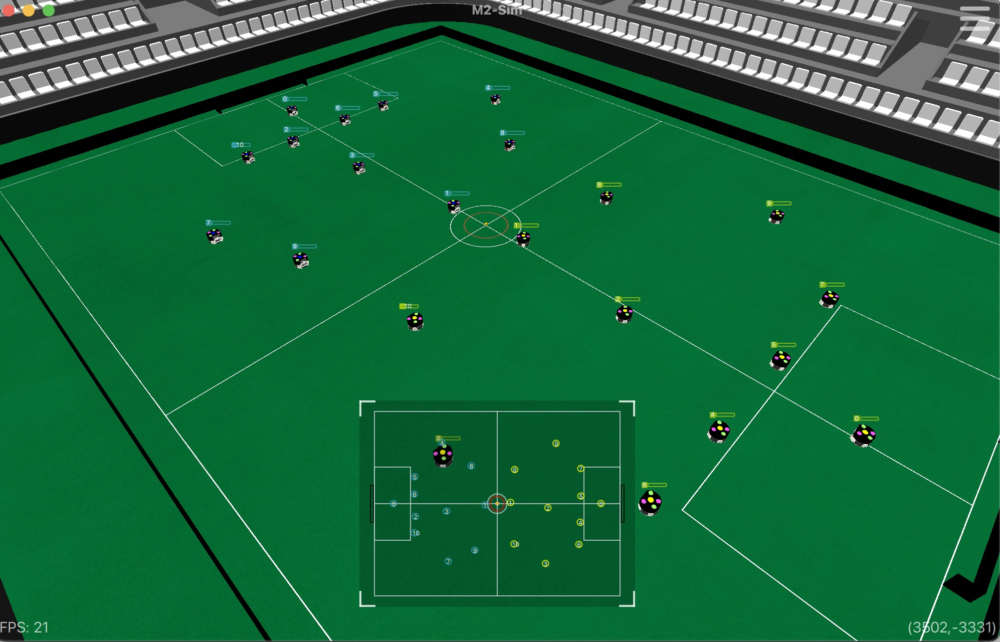

# m2-sim

## Introduction
Welcome to m2-sim, a simulation tool designed for the [RoboCup Soccer Small Size League (SSL)](https://ssl.robocup.org/).



## Features Summary
- Import custom 3D models
- Get pixel coordinates from the camera mounted on the robot
- Visualize values received via Protobuf by selecting each robot’s data

Please read [Documents](docs/)
  
## System Requirements
Before diving into the exciting world of RoboCup Soccer SSL with `m2-sim`, ensure your system meets the following requirements:

- **Qt6**: Version 6.8 is supported.
- **Protocol Buffer Compiler**: `protoc` is essential for compiling protocol buffers.

## Getting Started
To get started with `m2-sim`, follow these steps:

### 1. Install Dependencies
Make sure all necessary packages are installed. Open your terminal and run:
### Mac OS
```bash
brew update
brew install qt cmake boost@1.85 eigen protobuf@21 yaml-cpp vulkan-volk assimp bullet
```
### Ubuntu
Please install Qt 6.8.
```bash
sudo apt update
sudo apt install libeigen3-dev protobuf-compiler libyaml-cpp-dev cmake build-essential libassimp-dev assimp-utils libbullet-dev libboost-all-dev
```

### 2. Preparing 3D Models
Please read [how to import custom 3D model](docs/import_model.md)

To properly visualize the simulation, download the required 3D models and place them in the following directory:
```
~/ws/m2-sim/assets/
```

You can download sample 3D models from the following link:  
[Download 3D Models](https://drive.google.com/drive/folders/17iXSCv_ecgYn4Mx0ziXjV6I9hVO665dg?usp=share_link)


### 3. Building the Project
Set up and build the project using the following steps:

```bash
cd ~/ws/m2-sim/
mkdir build && cd build
cmake ..
make
```

### 4. Launch the GUI
Run the main application to start the GUI:
```bash
make run
```
This command executes the compiled binary and launches the graphical user interface. You can now start interacting with `m2-sim`.

### 5. Additional Notes
If you encounter errors during the build process, ensure all dependencies are installed and up-to-date. For troubleshooting, refer to the [official documentation](https://github.com/RoboCup-SSL/).

## Related Tools
Enhance your RoboCup Soccer SSL experience with these related tools:

- [ssl-game-controller](https://github.com/RoboCup-SSL/ssl-game-controller): The official game controller for managing match flow and rules.
- [ssl-autorefs](https://github.com/RoboCup-SSL/ssl-autorefs): Automated referee systems for unbiased and accurate game officiating.

## Contributing
We welcome contributions from the community! Please read our [CONTRIBUTING.md](CONTRIBUTING.md) for guidelines on how to get involved.

## License
This project is licensed under the GNU General Public License version 3 (GPL v3). See the [LICENSE](LICENSE) file for details.
